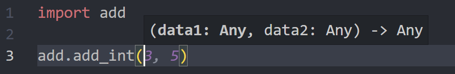
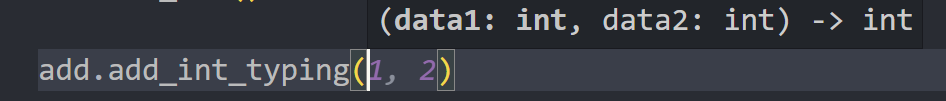

# Default Python Packages

편의를 위한 default Python packges를 정리한다.

## `typing`

Python은 원래 변수의 자료형이 지정되지 않는 자유로운 언어이다. 하지만 함수를 사용할 때 변수가 무엇인지 파악하려면 소스 코드를 다 살펴봐야 한다.

`typing` 패키지의 자료형들로 함수를 정의하면 입/출력 변수의 자료형을 알 수 있다.

패키지의 함수에서 자료형을 정의해두면 VSCode에서 `.`을 찍었을 때 자동완성도 알려준다.
```python
def add_int(data1, data2):
    return data1 + data2

def add_int_typing(data1: int, data2: int) -> int:
    return data1 + data2
```

자료형을 안 쓰면 Any로 나와서 도움이 안 된다.


자료형(`int)을 명시하면 다른 스크립트에서 사용할 때 알 수 있다.

모든 경우에 다 자료형을 쓸 필요는 없지만, 패키지로 만들어서 다른 스크립트에서 사용할 함수인 경우 자료형을 명시하는 것이 편리하다.

## `from _future__ import annotations`
Python은 코드를 위에서 아래로 한 줄씩 읽기 때문에 정의하지 않은 클래스를 typehint로 사용하는 경우 error가 생긴다. 이 import를 제일 위에 쓰면 typehint 해석을 미뤄서 에러 없이 서로 참조할 수 있다. (Python 3.10+에서는 default이다.)

## `from dataclasses import dataclass`
데이터를 담아두는 클래스를 만들 때는 이렇게 썼다.
```python
class Molecule:
    def __init__(self, name, weight, atoms):
        self.name = name
        self.weight = weight
        self.atoms = atoms
```

하지만 `@dataclass` 데코레이터를 활용하면 `__init__`함수를 알아서 만들 수 있다. 게다가 자료형을 지정했는데도 코드 길이가 짧아진다.
```python
@dataclass
class Molecule:
    name: str
    weight: float
    atoms: list
```

## `from pathlib import Path`
파일 경로를 **문자열**로 다루면 윈도우와 리눅스간 경로를 일관되게 관리하기 힘들다. `os.path`는 문자열 기반 경로를 다루는데, `folder + "/" + file`과 같이 번거롭게 문자열을 만들어야 하고, 윈도우에서는 경로 구분자를 `"\"`로 바꿔야 하는 번거로움도 있다.

파일 경로를 `Path`의 객체로 관리하면 `Path("folder") / "file"`과 같이 하나의 기호(`/`)로 경로를 다룰 수 있다. 또한 윈도우(보통 로컬)와 리눅스(보통 서버)에서 모두 호환이 되기 때문에 편리하다.

